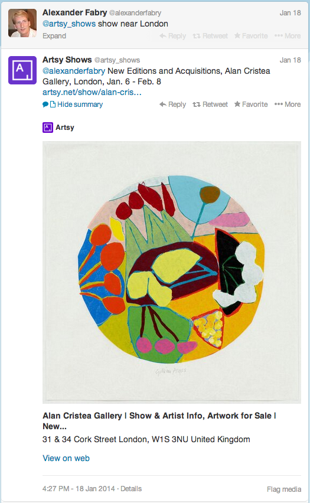

Artsy Feathers
==============

[](https://travis-ci.org/dblock/artsy-feathers)

Artsy Feathers is a set of examples that combine [Artsy Ruby client](https://github.com/artsy/artsy-ruby-client) and the [Twitter Ruby client](https://github.com/sferik/twitter) to tweet artworks and shows.

Follow on Twitter
-----------------

The [Artsy Shows](https://twitter.com/artsy_shows) BOT tweets new shows and will respond to queries that contain "show near [location]" directed at it. Follow [Artsy Shows on Twitter](https://twitter.com/artsy_shows).

 

Running
-------

Please note that Artsy currently doesn't have a public API program. API keys are required to run this sample. Email engineering@artsy.net and we'll notify you when this is available.

### Twitter

* [Register an Application](https://dev.twitter.com/apps/new).
* Change Access Level in Settings to Read/Write.
* Create an Access Token.
* Note the consumer key, secret, OAuth token and token secret.

### Artsy

* Note the Artsy application client id and client secret.

### Run

```
TWITTER_CONSUMER_KEY=...
TWITTER_CONSUMER_SECRET=...
TWITTER_OAUTH_TOKEN=...
TWITTER_OAUTH_TOKEN_SECRET=...
ARTSY_API_CLIENT_ID=...
ARTSY_API_CLIENT_SECRET=...
bundle exec ruby examples/tweet_new_shows.rb
```

Examples
--------

* [Tweet a New Artwork](examples/tweet_new_artwork.rb)
* [Tweet New Shows](examples/tweet_new_shows.rb)
* [Tweet Show Near Location](examples/tweet_show_near.rb)
* [Tweet Featured Posts](examples/tweet_featured_posts.rb)
* [Tweet Popular Searches](examples/tweet_popular_searches.rb)

Contributing
------------

Fork the project. Make your feature addition or bug fix with tests. Send a pull request. Bonus points for topic branches.

Copyright and License
---------------------

MIT License, see [LICENSE](http://github.com/dblock/mongoid-scroll/raw/master/LICENSE.md) for details.

(c) 2013-2014 [Daniel Doubrovkine](http://github.com/dblock), [Artsy](http://artsy.net)
